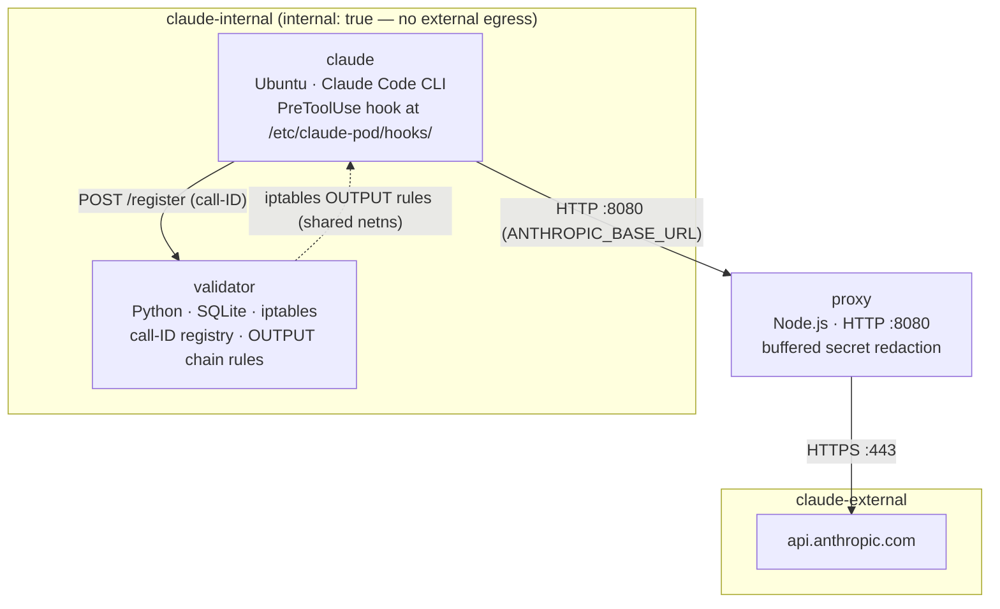
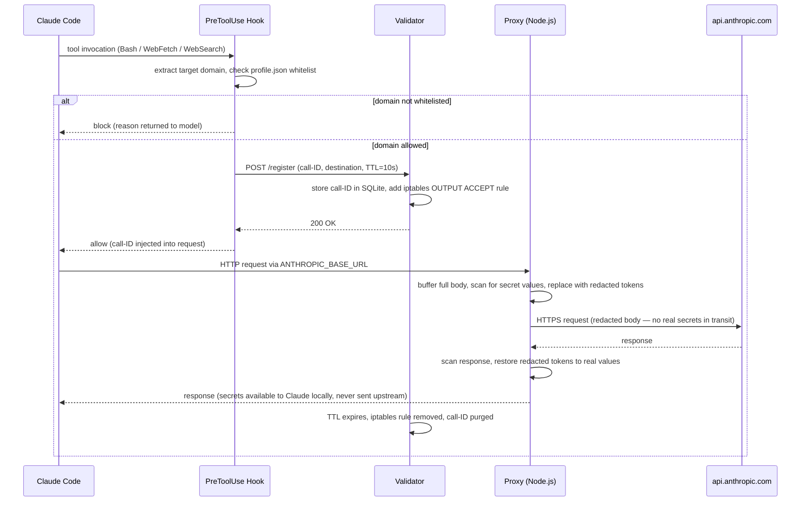
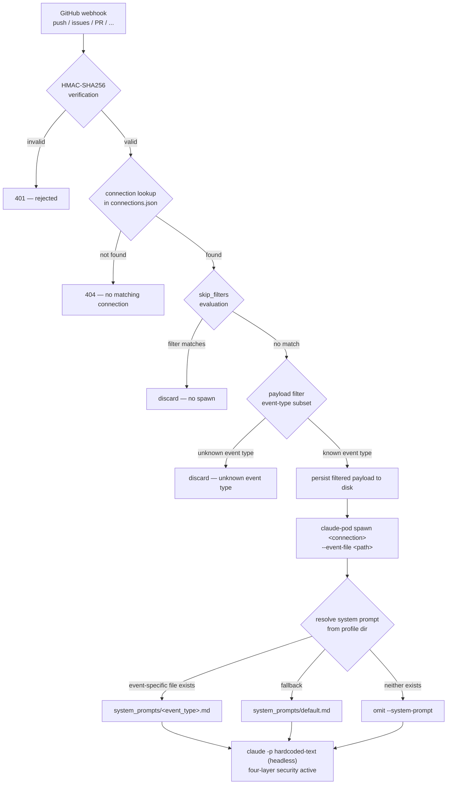

# Architecture

claude-pod enforces four independent security layers: Docker network isolation (no external egress by default), a PreToolUse hook that validates every outbound tool call before it executes, an Anthropic proxy that redacts secrets from LLM context, and an iptables-based validator that enforces network rules at the packet level. Each layer independently blocks exfiltration — bypassing one still leaves three others in place.

---

## Container and Network Topology

Three containers operate across two Docker Compose networks. The `claude-internal` network has `internal: true`, which blocks all external traffic at the Docker level. The proxy is the only container attached to both networks and is the sole exit point to `api.anthropic.com`.



**claude** — Ubuntu container running Claude Code CLI. The PreToolUse hook at `/etc/claude-pod/hooks/pre-tool-use.sh` is root-owned and not writable by the Claude process. Every `Bash`, `WebFetch`, and `WebSearch` call passes through it before executing.

**proxy** — Node.js service that accepts all Anthropic API traffic from the Claude container. It buffers the full request body, scans for secret values from `profile.json`, replaces them with opaque redacted tokens before forwarding upstream, then reverses the substitution on the response. `profile.json` is re-read on every request — no restart needed after secret changes.

**validator** — Python service sharing the Claude container's network namespace (`network_mode: service:claude`). It maintains a SQLite registry of call-IDs with 10-second TTLs and manages iptables OUTPUT chain rules. A background thread cleans up expired entries every 5 seconds.

**claude-internal network** — Docker Compose `internal: true` prevents any container on this network from routing packets to external hosts. Only the proxy bridges to the external network.

**claude-external network** — Standard Docker bridge network used by the proxy to reach `api.anthropic.com`. No other container is on this network.

---

## Call Chain Sequence

This diagram traces the lifecycle of a single outbound tool call — from Claude Code deciding to invoke a tool through the final response returning to the model.



**Step-by-step:**

1. **Tool invocation** — Claude Code decides to call `Bash`, `WebFetch`, or `WebSearch`. Claude Code invokes the registered PreToolUse hook before executing the tool.

2. **Domain check** — The hook extracts the target hostname from the tool payload (URL for WebFetch/WebSearch, command for Bash) and checks it against the `domains` list in `profile.json`. Calls to unregistered domains are blocked with a reason message returned directly to the model — Claude cannot retry a blocked call.

3. **Call-ID registration** — For allowed calls, the hook generates a UUID call-ID and POSTs it to the validator with the destination and a 10-second TTL. The validator writes the call-ID to SQLite and adds a time-limited iptables OUTPUT ACCEPT rule for the destination IP. Without this rule, the packet is rejected at the kernel level.

4. **Proxy receives the request** — Claude Code's Anthropic SDK sends the API request to `http://proxy:8080` (the `ANTHROPIC_BASE_URL` set in docker-compose). The proxy buffers the entire request body — no streaming in Phase 1.

5. **Secret redaction** — The proxy scans the buffered body for every raw secret value from `profile.json`. Each match is replaced with its `redacted` token (e.g. `REDACTED_GITHUB_TOKEN`). The redacted body is what Anthropic's API receives — the real secret value never leaves the internal network.

6. **Anthropic API call** — The proxy forwards the sanitized request over HTTPS to `api.anthropic.com` via the external network.

7. **Secret restoration** — The proxy buffers the full response and performs the reverse substitution: redacted tokens are replaced with real values so Claude can use them in subsequent tool calls (e.g. passing a token as a shell argument).

8. **Response returned** — The restored response is returned to Claude Code. Real secret values are available to Claude locally but were never transmitted to Anthropic's infrastructure.

9. **TTL expiry** — After 10 seconds the validator's background thread deletes the call-ID from SQLite and removes the iptables rule. Any subsequent connection attempt to the same destination requires a fresh registration.

---

*These diagrams describe the containers and scripts in `proxy/`, `validator/`, `lib/hooks/`, and `docker-compose.yml`. Update this file if those components change.*

---

## Agentic (Headless) Mode

claude-pod can operate as a fully automated agent: a GitHub webhook triggers the listener, which verifies the event, evaluates filters, and calls `claude-pod spawn`. Spawn starts `claude -p` (non-interactive) inside the same four-layer-secured container, passing a resolved system prompt and the full event JSON as context.

### Profile Directory

Each spawned Claude instance is configured by a named profile at `~/.claude-pod/profiles/<name>/`:

```
~/.claude-pod/profiles/<name>/
├── profile.json          # workspace path and secret definitions
├── .env                  # raw secret values (env vars)
└── system_prompts/
    ├── default.md        # fallback system prompt (optional)
    └── <event_type>.md   # event-specific system prompt (optional)
```

**`profile.json`** — defines the workspace and secrets for this profile. The `workspace` field is the absolute path to the Claude Code workspace directory. The `secrets` array contains entries with three fields each: `env_var` (the name of the environment variable in `.env` that holds the raw secret value), `redacted` (the opaque token substituted in Anthropic-bound requests instead of the real value), and `domains` (the list of domains to which this secret may be sent as an authorization credential). The domain whitelist enforced by the PreToolUse hook is derived from the union of all `domains` values across all `secrets` entries.

**`.env`** — holds the raw secret values referenced by `secrets[].env_var`. Values here are never written to any log and never transmitted upstream — they exist only within the container environment.

### System Prompt Resolution

When spawning, the system prompt passed via `--system-prompt` is resolved from the profile directory in this order:

1. `system_prompts/<event_type>.md` — if the spawn was triggered by an event (e.g., `push`, `issues`), the event-specific file is checked first
2. `system_prompts/default.md` — if no event-specific file exists, the default is used as a fallback
3. Omit `--system-prompt` — if neither file exists, spawn proceeds without a system prompt; this is not an error and Claude runs with no injected persona or instructions

The human-turn `-p` prompt is always the hardcoded string:
> Review the event payload and follow the instructions in the system prompt.

The full event JSON is appended to this prompt as a fenced `json` block so Claude receives the raw payload directly.

### Webhook-to-Spawn Pipeline



**Step-by-step:**

1. **Webhook receipt** — GitHub delivers a webhook POST to `webhook/listener.py`. The request includes an `X-Hub-Signature-256` header computed from the connection's `webhook_secret`.

2. **HMAC verification** — The listener extracts the repository's full name from the payload, looks up the matching entry in `~/.claude-pod/webhooks/connections.json`, and verifies the HMAC-SHA256 signature using that entry's `webhook_secret`. Invalid signatures are rejected with HTTP 401 — no spawn occurs.

3. **Connection lookup** — The listener matches the webhook's `repository.full_name` against `connections.json`. If no entry matches, the listener returns HTTP 404.

4. **Skip-filter evaluation** — Each commit message in the payload is checked against the connection's `skip_filters` list (e.g., `[skip-claude]`). If every commit matches a filter pattern the event is discarded without spawning. Spawn proceeds only when no filter matches.

   Each connection may also carry an optional `max_turns` integer field (default `20`). This value is read by `claude-pod spawn` and forwarded as `--max-turns` to `claude -p`, capping the number of agentic rounds for that headless session. Use `claude-pod set-max-turns <connection> <value>` to update the field without manual JSON editing.

5. **Payload filter** — The payload is reduced to an event-type-specific subset before being written to disk. Fields that carry no value for an agent (API URL templates, `node_id`, repository statistics, setting flags, VCS URLs, `avatar_url`, etc.) are stripped. If the event type is not in the supported set (`push`, `issues`, `pull_request`, `issue_comment`, `pull_request_review_comment`, `workflow_run`) the event is discarded without spawning. The HMAC check and skip-filter evaluation operate on the full raw payload; only the persisted file and the spawned agent receive the filtered subset.

6. **Event persistence** — The filtered event JSON is written to a file on disk. This file path is passed to the spawn subprocess and is the authoritative source of the event payload.

7. **Spawn** — The listener calls `claude-pod spawn <connection_name> --event-file <path>` as a blocking subprocess. The spawn command resolves the profile named by the connection, starts the Docker containers if needed, and prepares the invocation of `claude -p`.

8. **System prompt resolution** — Before invoking `claude -p`, spawn walks the resolution chain: first `system_prompts/<event_type>.md`, then `system_prompts/default.md`. The content of the resolved file is passed as `--system-prompt`. If neither file exists the flag is omitted entirely — spawn does not fail.

9. **Human-turn prompt** — The `-p` argument is always the hardcoded string: `"Review the event payload and follow the instructions in the system prompt."` If `--event-file` was provided, the filtered event JSON is appended to this prompt after a `---` separator, labeled with the event type and wrapped in a fenced `json` block:

   ```
   ---
   Event Payload (push)
   ```json
   { ... full event JSON ... }
   ```
   ```

   Manual spawns invoked without `--event-file` receive no appended payload block — the prompt contains only the hardcoded fallback text.

10. **Headless Claude execution** — `claude -p` runs non-interactively inside the container. All four security layers remain active: the PreToolUse hook, the Anthropic proxy, the iptables call validator, and Docker network isolation apply identically to headless sessions as they do to interactive ones.

---

*This section describes `webhook/listener.py`, `bin/claude-pod` (spawn and profile logic), and `~/.claude-pod/profiles/`. Update this section if those components change.*
